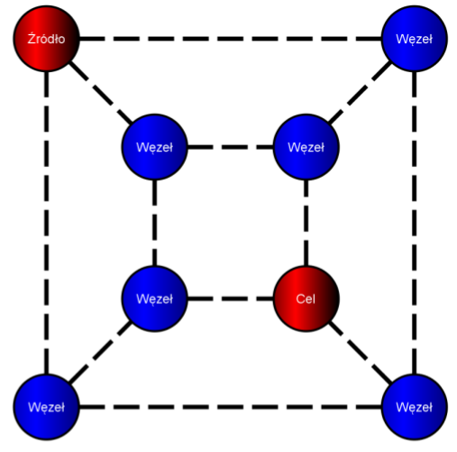
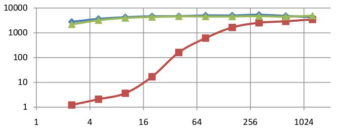
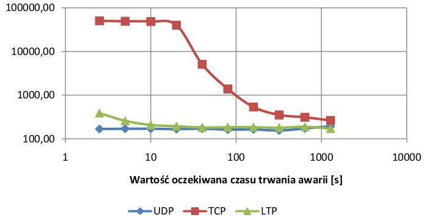
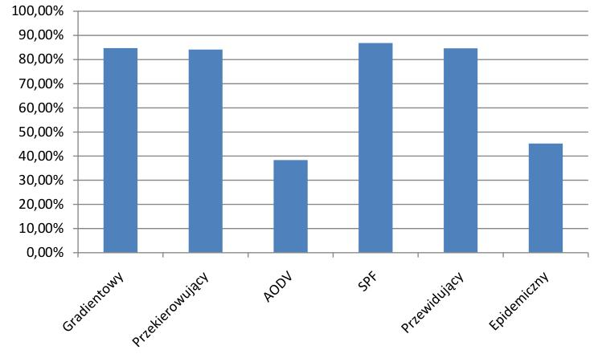
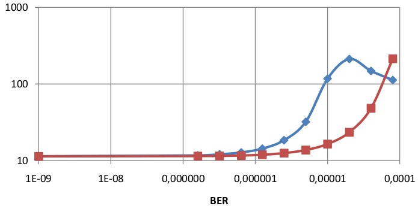

# DTN network simulator
This is an old project of mine: Delay And Discruption Tolerant Network (DTN) simulator.
It was written as my master's thesis several years ago and therefor the code quality matches my skills at that point in time.
Still I think that it may be usefull for many people, so I decided to publish it.
You can also read my master's thesis (if you speak Polish).

## Screenshots
The following is a small subset of charts generated from the data from simulations performed during my master's thesis.
It clearly shows how many differen combinations of networks, data and tests you are able to achieve using this simulator.

### Example network:

### Delivered data (in MB) depending on expected period of link failure (in seconds):

### Average delay (in seconds) depending on expected period of link failure (in seconds):

### Percent of delivered data for diffent routing algorithms in a network similar to the Internet:

### Delivered data (in GB) depending on BER for two cases: when nodes take responsibility for retransmitting bundles (red) and when they don't (blue):

## Main Features
Its main purpose was to simulate and compare several routing approaches.
Depending on network structe and used transport protocols some algorithms work bette than other.
This application includes:

### The Bundle protocol:
This is the core of the application - Bundle protocols is supposed to create a new layer in the ISO OSI and TCP/IP protocol stack models and it is supposed to transport data in a way that does not depend on the underlying protocol (for example it can use IP, Apple Talk, Ethernet directly or IPX).

### 7 Routing algorithms:
* Static routing.
* Epidemic - sends copies of packets everywhere.
* Gradient 
* Gradient with redirection
* AODV-like protocol
* Dijkstra (OSPF-like)
* Predictable (has ability to predict link breaks)

### Simulation of 3 transport protocols:
* __LLDP__ - this is the delay and disruption tolerant protocol designed to handle environments where TCP can't make it.
* __UDP__ - simulation of UDP protocol.
* __TCP__ - simulation of TCP protocol with its main features such as retransmission on error, slow start, windows.

### 9 working scenarios:
* __Asymetric__ - simulation of asymetric link.
* __BER__ - links get huge bit-error-rates.
* __Cosmos__ - simulation of what is a classic interplanetary communication scenario.
* __Delay__ - simulation of huge delays in the network.
* __Internet__ - network that's characteristic is similar to the currently working Internet.
* __Link break__ - simulation of many link breaks.
* __Mule__ - simulation of a network based on mules (moving devices that exchange the data).
* __Sensor__ - simulation of a sensor network.
* __Zebranet__ - simulation of Zebranet; a network that was in the past used to monitor movement of zebras.